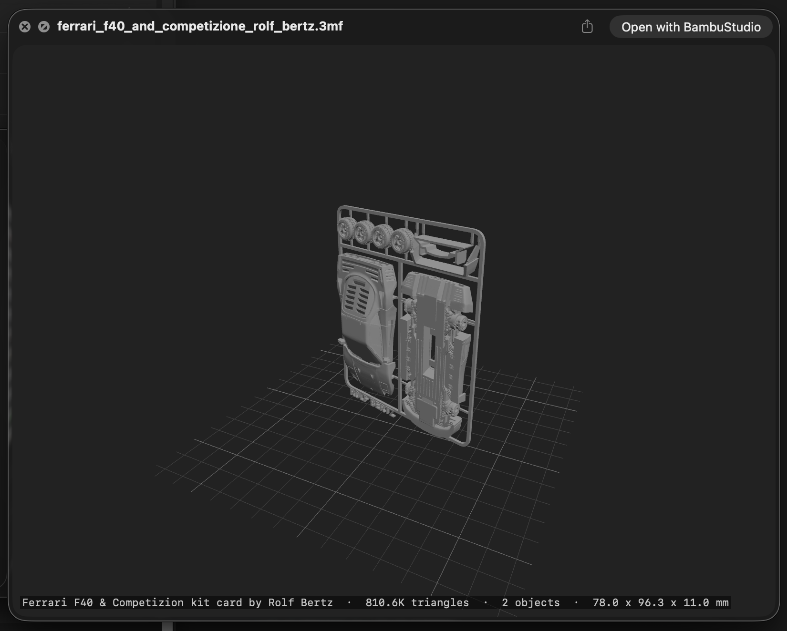

# Preview3MF

A macOS Quick Look extension for **.3mf files** (3D Manufacturing Format). Press Space on any `.3mf` file in Finder to see a 3D preview of the model — no slicer needed.

<p align="center">
  
</p>

## Features

- **Quick Look integration** — press Space in Finder to preview `.3mf` files
- **3D rendering** with SceneKit — proper lighting, shading, and materials
- **Build-plate grid** — a world-fixed reference grid under the model, scaled to its footprint
- **Auto-rotating model** — spins around the vertical axis so you can see all sides
- **Interactive controls** — orbit and zoom with your mouse/trackpad in the preview
- **Model info overlay** — triangle count, object count, and dimensions parsed from the file
- **Color support** — renders per-object/per-triangle material colors when present
- **Dark mode** — preview and host app adapt to the system appearance
- **Finder thumbnails** — rendered icons for `.3mf` files, reusing the slicer's embedded preview when available
- **Multi-object support** — handles files with multiple mesh objects (Bambu Studio, PrusaSlicer, etc.)
- **Drag-and-drop** — drop `.3mf` files into the host app for inline preview

## Installation

1. Download the latest release (or build from source)
2. Move `Preview3MF.app` to `/Applications`
3. Launch it once — this registers the Quick Look extensions
4. Go to **System Settings → Privacy & Security → Extensions → Quick Look** and make sure **both** are enabled:
   - **PreviewExtension** — the 3D preview shown when you press Space
   - **ThumbnailExtension** — the rendered icon shown in Finder
5. That's it — press Space on any `.3mf` file in Finder, or just look at the icons

> **Tip:** If Quick Look doesn't pick it up immediately, run `qlmanage -r` in Terminal to reset the Quick Look cache.

## Building from Source

Requires Xcode 15+ and macOS 13+.

```bash
git clone https://github.com/cavoco/Preview3MF.git
cd Preview3MF
xcodebuild -scheme Preview3MF -configuration Release build
```

Or open `Preview3MF.xcodeproj` in Xcode and hit Cmd+R.

## How It Works

`.3mf` files are ZIP archives containing XML model data. The extension:

1. Extracts all `.model` files from the archive (using [ZIPFoundation](https://github.com/weichsel/ZIPFoundation))
2. Parses `<vertex>`, `<triangle>`, `<build>` items, materials, and metadata from the XML
3. Builds SceneKit geometry with per-face normals for flat shading, applying each build item's transform
4. Renders with a 3-point lighting setup, a build-plate grid, and an auto-framed camera

For Finder **thumbnails**, slicers usually bake a rendered PNG into the package — the thumbnail
extension reuses that embedded image as a fast path and only falls back to SceneKit rendering when
none is present.

## Project Structure

```
├── Preview3MF/              # Host app (SwiftUI)
│   ├── Preview3MFApp.swift
│   └── ContentView.swift    # Drag-and-drop preview UI
├── PreviewExtension/        # Quick Look preview extension (Space to preview)
│   ├── PreviewViewController.swift
│   └── Info.plist           # UTI + QL config
├── ThumbnailExtension/      # Quick Look thumbnail extension (Finder icons)
│   └── ThumbnailProvider.swift
└── Shared/                  # Used by all targets
    ├── ThreeMFParser.swift  # ZIP extraction, XML parsing, metadata, embedded thumbnails
    └── SceneBuilder.swift   # Mesh → SCNScene with lighting and build-plate grid
```

## License

MIT

